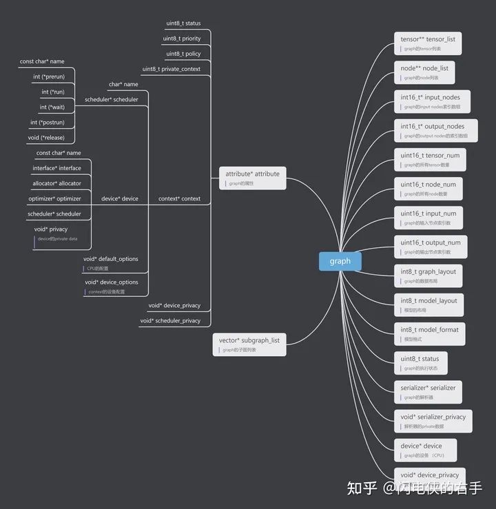

[原始代码仓库](https://github.com/OAID/Tengine.git)
添加\删除远程仓库：
___
git remote -v
git remote add origin  https://github.com/OAID/Tengine.git
git remote rm origin
___

ndk-r20b编译
cmake -DCMAKE_TOOLCHAIN_FILE=$ANDROID_NDK/build/cmake/android.toolchain.cmake -DANDROID_ABI="armeabi-v7a" -DANDROID_ARM_NEON=ON -DANDROID_PLATFORM=android-19 .. -G "CodeBlocks - MinGW Makefiles"
make
make install

[源码解读](https://mp.weixin.qq.com/mp/appmsgalbum?__biz=Mzg4ODY4Mjg0OQ==&action=getalbum&album_id=2082080247415472135&scene=173&from_msgid=2247483757&from_itemidx=1&count=3&nolastread=1#wechat_redirect)
